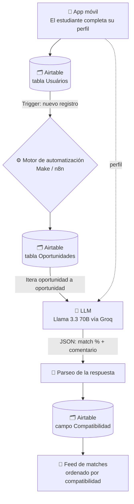

<h1 align="center">Solvia</h1>

<p align="center">
  <b>Match entre estudiantes y becas internacionales, con IA</b><br>
  <i>La lógica de Tinder aplicada a las oportunidades educativas: swipe, match, aplica.</i>
</p>

<p align="center">
  <a href="https://ash-wheel-25202039.figma.site/"></a>
  
</p>

---

## El problema

Hay miles de becas, cursos y programas internacionales abiertos en cualquier momento. El problema no es que no existan: es que el estudiante no sabe **cuáles encajan con su perfil** y acaba descartando por agotamiento antes de encontrar la que le corresponde. Buscar una beca hoy significa abrir veinte pestañas y leer requisitos escritos en jerga administrativa.

## La solución

Solvia le da la vuelta al proceso. En lugar de que el estudiante busque, **las oportunidades vienen a él**, ordenadas por compatibilidad real:

1. El estudiante rellena su perfil una sola vez — formación, área de interés, idiomas, país de destino, contexto socioeconómico.
2. Un modelo de lenguaje compara ese perfil contra cada oportunidad de la base de datos y devuelve un **porcentaje de compatibilidad (20–95%)** con una explicación en lenguaje claro de *por qué* encaja.
3. El estudiante recibe las becas como tarjetas tipo Tinder: swipe, guarda favoritos, ve el detalle y aplica.

Lo importante no es el porcentaje: es el **comentario que lo acompaña**. El modelo devuelve qué requisitos concretos del perfil coinciden, así que el estudiante entiende su posición antes de invertir horas en una solicitud.

## Cómo funciona



El prompt fuerza al modelo a responder **solo en JSON** (`{"match": 20-95, "comentario": "..."}`), lo que permite parsear la respuesta y escribirla en Airtable sin intervención manual. Es la parte que hace que esto sea un pipeline y no una demo de chat.

## Prototipo

**[👉 Ver el prototipo navegable](https://ash-wheel-25202039.figma.site/)**

Diez pantallas diseñadas a 390×844 px (iPhone 12/13/14), listas para *data binding*:

| # | Pantalla | Función |
|---|---|---|
| 01 | Onboarding | Bienvenida y presentación del producto |
| 02 | Signup | Registro y formulario de perfil |
| 03 | Loading | Estado de espera mientras la IA calcula los matches |
| 04 | Results | Feed de matches con porcentaje de compatibilidad |
| 05 | Scholarship Detail | Ficha completa de la beca y progreso de la solicitud |
| 06 | Favorites | Becas guardadas |
| 07 | Learn | Artículos y consejos para solicitar |
| 08 | Community | Grupos y comunidad de estudiantes |
| 09 | Profile | Perfil del usuario y estadísticas |
| 10 | Bottom Nav | Navegación inferior |

Paleta: azul `#4F46E5` → lila `#7C3AED`, sobre neutros suaves. Sistema de espaciado de 4 px, esquinas de 12–24 px, iconografía Lucide.

## Stack

| Capa | Herramienta |
|---|---|
| Diseño / prototipo | Figma · Tailwind CSS · ShadCN/UI |
| Base de datos | Airtable (`Usuários`, `Oportunidades`, relación N:M) |
| Orquestación | Make (escenario principal) · n8n (versión inicial) |
| IA | Llama 3.3 70B vía Groq API · GPT-4 en la primera iteración |
| Integración | HTTP / REST · webhooks |

## Contenido del repositorio

```
.
├── make_solvia_scenario.json      # Escenario de Make: trigger → match IA → escritura en Airtable
├── n8n_oportuniza_workflow.json   # Primera iteración en n8n (nombre original del proyecto: Oportuniza)
└── README.md
```

### Reproducirlo

1. Importa el blueprint en Make (o el workflow en n8n).
2. Sustituye los placeholders:
   - `YOUR_GROQ_API_KEY` → tu clave de [Groq](https://console.groq.com)
   - `YOUR_AIRTABLE_BASE_ID` → el ID de tu base de Airtable
3. Reconecta las credenciales de Airtable en cada módulo.
4. Crea las tablas `Usuários` y `Oportunidades` con los campos que aparecen en el blueprint (`Requisitos`, `Área de estudo`, `País/Cidade`, `Compatibilidade`…).

> Los exports de este repositorio están **sanitizados**: ninguna clave real viaja en el JSON. Si los adaptas, no vuelvas a hardcodear el token en el módulo HTTP — usa el gestor de credenciales de Make o n8n.

## Estado y siguientes pasos

Proyecto desarrollado durante el **Curso de Especialista en IA**. Es un prototipo funcional de extremo a extremo (perfil → match → resultado), no un producto en producción. Lo siguiente:

- [ ] Sustituir el prompt único por *embeddings* + búsqueda vectorial: escala mejor que iterar oportunidad a oportunidad con el LLM
- [ ] Ingesta automática de convocatorias desde fuentes oficiales, en vez de carga manual en Airtable
- [ ] Feedback loop: aprender de las becas que el usuario guarda y descarta para reordenar el feed
- [ ] Frontend real (React Native / Bravo Studio) conectado a la API

## Autora

**Thaís Brandão** — Data Analyst & AI Strategist
[LinkedIn](https://www.linkedin.com/in/thaisbrand%C3%A3o/) · [GitHub](https://github.com/thaisbrandao)
# solvia-ai-scholarship-matching
App tipo Tinder que hace match entre el perfil de un estudiante y becas internacionales usando LLMs, Airtable y automatización sin código.
